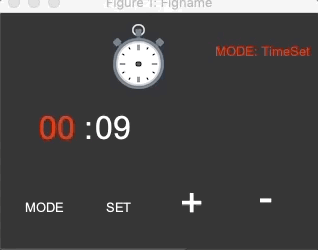

# Stop-Watch-STM
The Project is developed using State-flow and Simulink to make pseudo concurrent tasks [Tracking the time, Switching between a set of operations/modes and checking the alarm either expired or not]. The final state machine model is auto generated into C code compatible with Discovery board, managed by ERICA OS.

#### MODEs Control: Switching between modes [Time Tracking, Time Set, Alarm Manage, and StopWatch]

#### StopWatch Mode states of operations [Start, Stop and Reset]

  

#### Project State: Stopped
##### TODO:
1. Implement Alarm Manage Sub-State Machine
2. Implement Time Set Sub-State Machine
3. AutoGenerate the code
